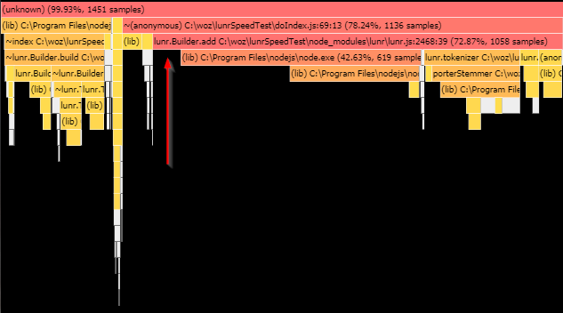

# nodejs profiling example

Example of using the built-in nodejs profiler.


## What we're profiling

Building a lunr index of text files on a local filesystem. It currently takes
about 3 seconds to index 1000 files.

Profile the app:

> ./profile.sh

This outputs a file `profile_output.txt`. See the 'Reading the nodejs profiler
output' section below for how to interpret this file.

We can see that 81% of process time is spent in 'shared libraries', 77/81 of
that being node.exe:

```
 [Summary]:
   ticks  total  nonlib   name
    315   18.6%   96.6%  JavaScript
      0    0.0%    0.0%  C++
     80    4.7%   24.5%  GC
   1369   80.8%          Shared libraries
     11    0.6%          Unaccounted

 [Shared libraries]:
   ticks  total  nonlib   name
   1303   76.9%          C:\Program Files\nodejs\node.exe
     65    3.8%          C:\WINDOWS\SYSTEM32\ntdll.dll
      1    0.1%          C:\WINDOWS\System32\KERNEL32.DLL
```

Using the [online profile visualiser](https://mapbox.github.io/flamebearer/#),
it seems that most of the calls to node are due to builder.add, which is a
little confusing. I think this may be due to the async readfile calling add,
which is 'blaming' builder.add for the time spent reading files from the
filesystem. Let's separate the two operations.




## separate reading files

Turns out this is very fast. It's all in builder.add. However, builder.add
calls node.exe, where our app spends most of its time. There's no more
information in the profiler output as to what's happening during all this time
spent in node.


-----------------------------------------------------------------------
## Reading the nodejs profiler output

The default profiler is a sampling profiler, which means it records the current
instruction pointer at certain intervals.

### Glossary

- ticks:       number of recorded instruction pointer locations
- unaccounted: number of instruction pointer locations that couldn't be traced
               back to a known function
- nonlib:      ?
- LazyCompile: the function was compiled lazily. Not the number of ticks spent
               in the compiler!
- *:           optimised function
- ~:           unoptimised function

### Bottom up section

- Read indented lines as "was called by" the parent line
- I'd recommend a visual representation over this


## Visualising profiler output

There are a number of tools, here's a handy online one: https://mapbox.github.io/flamebearer/#


## References

- [nodejs docs](https://nodejs.org/en/docs/guides/simple-profiling/)
- [dude explains profiler output](https://groups.google.com/forum/#!topic/nodejs/oRbX5eZvOPg)
- [v8 profiler docs](https://v8.dev/docs/profile)
- [online profile visualiser](https://mapbox.github.io/flamebearer/#)
